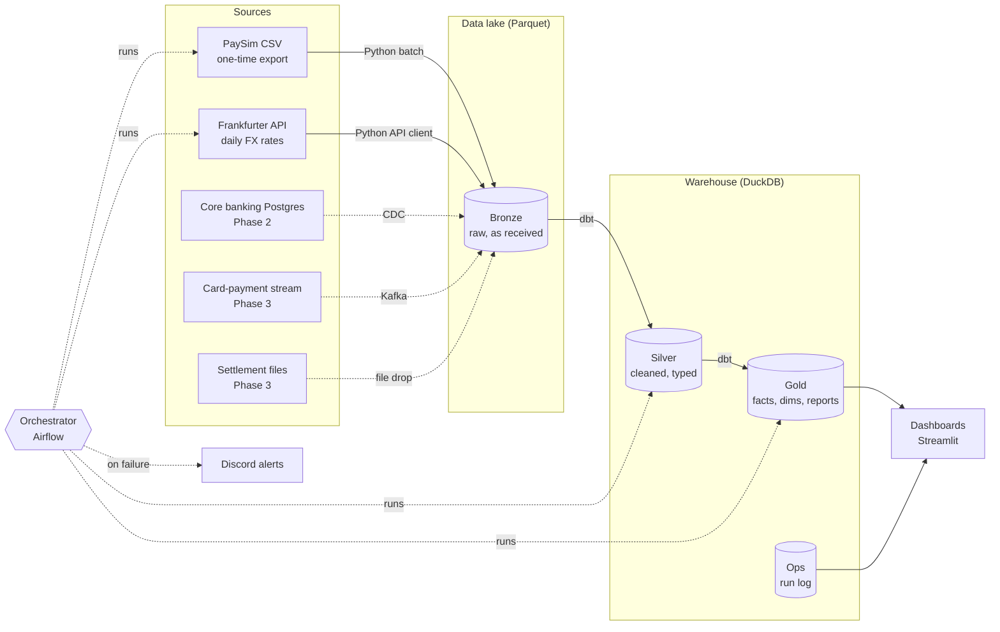
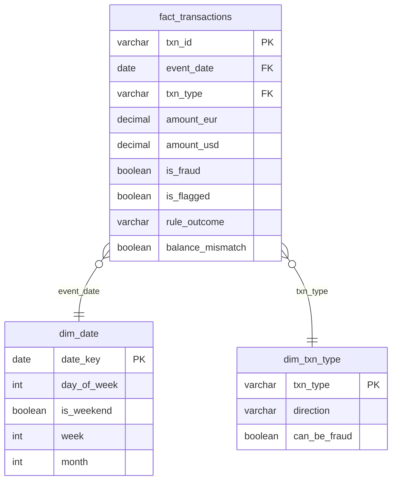

# Architecture & Data Model – Neobank Data Platform

| | |
|---|---|
| **Status** | Draft – for review |
| **Implements** | [requirements.md](requirements.md) v2 |
| **Last updated** | 2026-10-05 |

## 1. Overview

The platform runs entirely on a local machine. Data flows through three layers
(**bronze → silver → gold**) and is served to dashboards. Every step is idempotent,
tested and monitored.



## 2. Technology choices

| Concern | Choice | Why | Alternatives considered |
|---|---|---|---|
| Data lake storage | Local folders, Parquet, Hive partitions → **MinIO** (S3-compatible) in Phase 2 | Free, same layout as cloud object storage; switching to S3 later only changes the path | Cloud S3/GCS (cost) |
| File format | **Parquet** (zstd) | Columnar, compressed, typed, read by every engine | CSV (no types, slow), Delta/Iceberg (overkill for now) |
| Warehouse / query engine | **DuckDB** | Runs in-process, no server, reads Parquet directly, fast on 6M+ rows | Postgres (slower for analytics), Snowflake/BigQuery (cost) |
| Transformations | **dbt-core + dbt-duckdb** | Industry standard; SQL models, built-in tests, docs and lineage | Plain SQL scripts (no tests/lineage), Spark (overkill for this volume) |
| Data quality | **dbt tests** (+ `dbt-expectations`) in silver/gold; Python checks at ingestion | Tests live next to the models they protect | Great Expectations (heavier setup) |
| Orchestration | **Apache Airflow** (Docker), from Phase 2 | Most requested orchestrator in DE job postings; Docker is needed anyway for Postgres/Kafka | Dagster (runs natively on Windows, nicer local dev) |
| Alerting | **Discord webhook** | Free, instant, same pattern as Slack/Teams webhooks | Email |
| Dashboards | **Streamlit** on DuckDB | Pure Python, quick, no extra server | Metabase/Superset (heavier, need Docker) |
| CI | **GitHub Actions** | Runs tests + `dbt build` on a sample on every pull request | – |

## 3. Layers

| Layer | Purpose | Rules | Where |
|---|---|---|---|
| **Bronze** | Exact copy of source data | Never modified; all columns as received (strings); lineage columns added; partitioned by date | `data/lake/bronze/` (Parquet) |
| **Silver** | Clean, typed, trustworthy data, one row per real-world event | Types applied (`DECIMAL(18,2)` for money); IDs created; PII masked; quality flags added – **rows are flagged, never dropped** | DuckDB schema `silver` |
| **Gold** | Business-ready: facts, dimensions, reports | Uses only definitions from requirements §5; one place per metric | DuckDB schema `gold` |
| **Ops** | Pipeline metadata | One row per pipeline run | DuckDB schema `ops` |

## 4. Data model

### 4.1 Bronze

| Table | Grain | Source | Partition |
|---|---|---|---|
| `bronze/paysim/transactions` | one row per CSV line | PaySim CSV | `event_date` |
| `bronze/fx/rates` | one row per API response per day | Frankfurter API (raw JSON kept as string) | `rate_date` |

Lineage columns on every bronze table: `_source_file`, `_source_sha256`, `_source_row`, `_ingested_at`.

### 4.2 Silver

**`silver.transactions`** – one row per transaction

| Column | Type | Derivation |
|---|---|---|
| `txn_id` | VARCHAR | `sha256(_source_sha256 ‖ ':' ‖ _source_row)` – PaySim has no ID; this is stable across re-runs |
| `event_ts` | TIMESTAMP (UTC) | `2025-01-01 00:00 + (step − 1) hours` |
| `event_date` | DATE | from `event_ts` |
| `txn_type` | VARCHAR | `type` (PAYMENT, TRANSFER, CASH_OUT, CASH_IN, DEBIT) |
| `amount_eur` | DECIMAL(18,2) | `amount` (local currency assumed EUR – requirements §15) |
| `sender_key` | VARCHAR | `sha256(salt ‖ nameOrig)` – masked customer ID |
| `receiver_key` | VARCHAR | masked for customers; merchant IDs kept as is |
| `receiver_type` | VARCHAR | `customer` (`C…`) or `merchant` (`M…`) |
| `sender_balance_before` / `_after` | DECIMAL(18,2) | `oldbalanceOrg` / `newbalanceOrig` – informational only |
| `receiver_balance_before` / `_after` | DECIMAL(18,2) | `oldbalanceDest` / `newbalanceDest` – informational only |
| `is_fraud` | BOOLEAN | `isFraud = 1` |
| `is_flagged` | BOOLEAN | `isFlaggedFraud = 1` (blocked by core system) |
| `balance_mismatch` | BOOLEAN | sender balance change ≠ amount (requirements §8) |
| lineage columns | | carried from bronze |

**`silver.fx_rates`** – one row per date per currency

| Column | Type | Derivation |
|---|---|---|
| `rate_date` | DATE | every calendar day (weekends/holidays filled with last published rate – *pending Finance, open item 4*) |
| `base_currency` | VARCHAR | `EUR` |
| `quote_currency` | VARCHAR | `USD`, `GBP` |
| `rate` | DECIMAL(18,8) | from API |
| `is_filled` | BOOLEAN | true if carried forward from an earlier date |

**`pii.customer_map`** – `sender_key ↔ nameOrig`, kept in a separate restricted schema; only Risk-facing
reports join to it (simulates role-based access, requirements §9).

### 4.3 Gold



- `rule_outcome` = `caught` / `missed` / `false_alarm` / `clean` (requirements §5).
- **No customer dimension:** profiling showed 99.9% of customers appear once, so a customer dimension
  (or SCD2 history) would add no value for this source. Revisit when core banking CDC arrives (Phase 2).

Report tables (one per dashboard need):

| Table | Grain | Serves |
|---|---|---|
| `agg_daily_by_type` | day × txn_type | Finance: count, value EUR/USD; Risk: fraud rate by type |
| `agg_daily_fraud` | day | Risk: daily trend; Finance: fraud value attempted/lost |
| `agg_rule_performance` | week | Risk: caught / missed / false alarms, catch rate, precision |
| `rpt_suspicious_transactions` | transaction (previous day) | Risk daily list – joins `pii.customer_map` |

### 4.4 Ops

**`ops.pipeline_runs`** – `run_id`, `pipeline`, `step`, `started_at`, `finished_at`, `status`,
`rows_in`, `rows_out`, `error_message`. Feeds the Operations status view and alert messages.

## 5. Data quality checks

| Layer | Check | Severity |
|---|---|---|
| Ingestion | rows written = rows in source file; load not empty | Critical |
| Silver | `txn_id` unique and not null | Critical |
| Silver | `amount_eur` not null, ≥ 0, ≤ 10,000,000 | Critical |
| Silver | `txn_type` in accepted list | Critical |
| Silver | `is_flagged` implies `txn_type = 'TRANSFER'` and amount > 200,000 | Warning |
| Silver | `fx_rates` has a rate for every date in transactions | Critical |
| Gold | row count and total `amount_eur` in `fact_transactions` = silver | Critical |
| Gold | sum of `agg_daily_by_type` = `fact_transactions` totals | Critical |
| Gold | `rule_outcome` counts add up to total fraud | Critical |

## 6. Conventions

| Item | Rule | Example |
|---|---|---|
| Case | `snake_case` everywhere | `event_date` |
| Table prefixes (gold) | `fact_`, `dim_`, `agg_`, `rpt_` | `fact_transactions` |
| Keys | `_id` natural/generated ID, `_key` masked or surrogate key | `txn_id`, `sender_key` |
| Times | `_ts` timestamp (always UTC), `_date` date | `event_ts` |
| Booleans | `is_` / `has_` prefix | `is_fraud` |
| Money | `amount_<currency>`, `DECIMAL(18,2)` – never FLOAT | `amount_usd` |
| Lineage | leading underscore | `_ingested_at` |

## 7. Environments

| | dev | prod |
|---|---|---|
| Lake | `data/dev/lake` | `data/prod/lake` |
| Warehouse | `data/dev/neobank.duckdb` | `data/prod/neobank.duckdb` |
| dbt target | `dev` | `prod` |
| Data | 1-day sample | full history |
| Alerts | off | Discord |

## 8. Repository structure (target)

```
neobank_data_platform/
├── ingestion/          # Python extract/load jobs (bronze)
├── transform/          # dbt project (silver, gold, tests)
├── orchestration/      # Airflow DAGs (Phase 2)
├── dashboards/         # Streamlit app
├── common/             # shared code: alerts, run logging, config
├── analysis/           # profiling and ad-hoc investigation
├── tests/              # pytest
├── docs/               # requirements, architecture, runbook
└── .github/workflows/  # CI
```

## 9. Phases

| Phase | Scope |
|---|---|
| **1** | PaySim + FX ingestion → silver/gold (dbt) → quality tests → Discord alerts → Streamlit dashboards → CI |
| **2** | Docker: MinIO, Postgres core banking with CDC, Airflow orchestration |
| **3** | Kafka card stream, settlement files + reconciliation, stretch fraud rule |

## 10. Decisions to confirm in review

1. **Airflow vs Dagster** – Airflow chosen for job-market relevance; it needs Docker, so orchestration starts
   in Phase 2. Until then pipelines run by command. *Alternative:* Dagster now, natively on Windows.
2. **Streamlit vs Metabase** for dashboards.
3. **No customer dimension** in Phase 1 (justified by profiling, §4.3).
